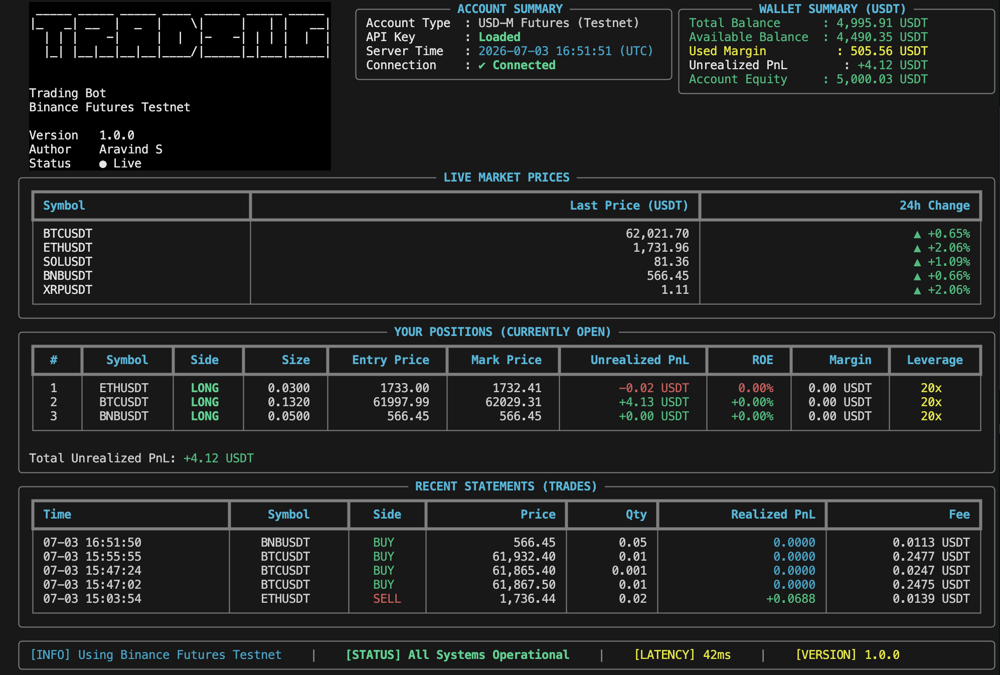
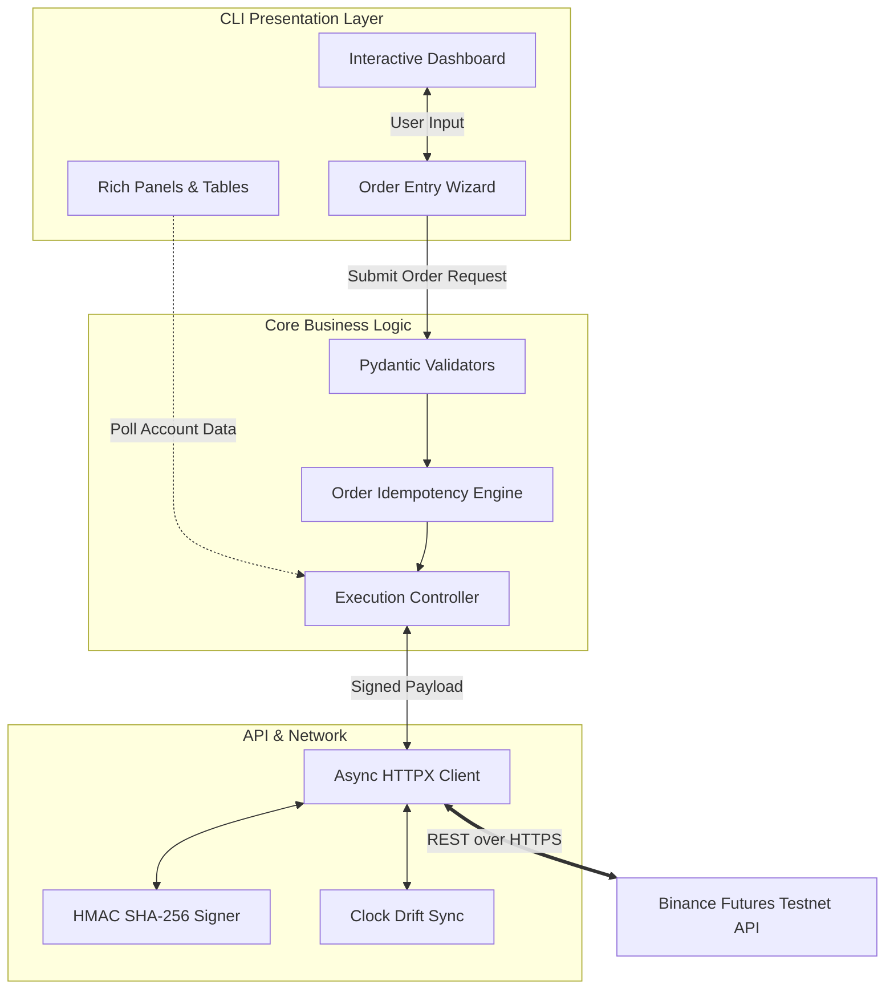
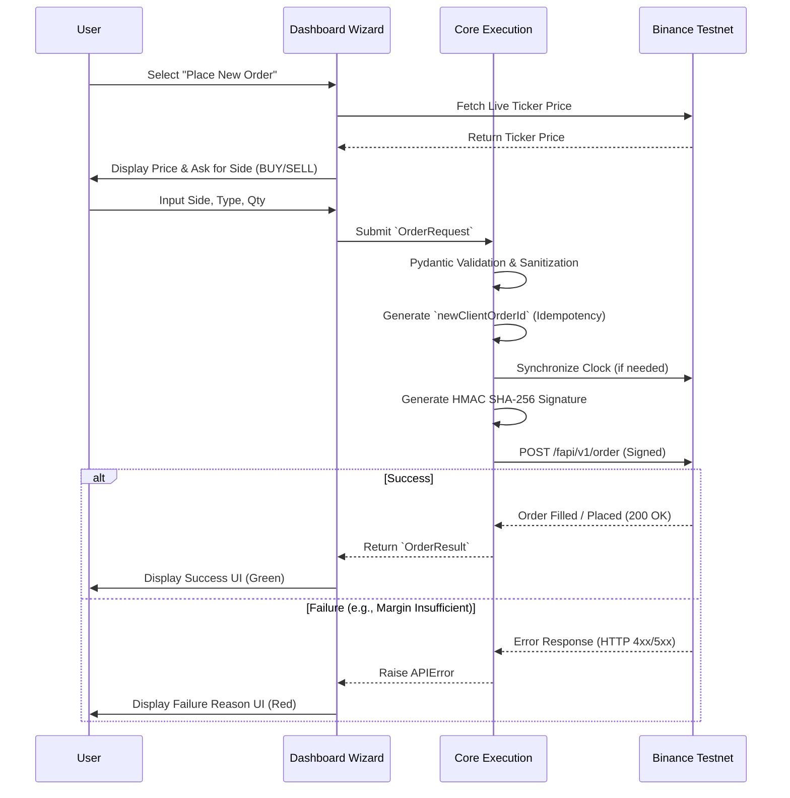

# Binance Futures Testnet Trading Bot (CLI)


<p align="center">
  
  <br>
  <em>The interactive terminal dashboard — live prices, wallet, positions, and recent trades, all rendered from the Binance Futures Testnet.</em>
</p>

A robust, asynchronous Python trading bot designed exclusively for the **Binance Futures Testnet (USDT-M)**. This project features a high-performance backend with strict Pydantic data validation and an incredibly rich, terminal-based Dashboard UI that rivals professional trading software.

Built as an internship submission, this project demonstrates scalable architecture, robust error handling, async network requests, and advanced CLI engineering.

---

## 🎯 Key Features

- **Rich Terminal Dashboard UI**: A fully interactive terminal dashboard built with `rich` and `questionary`. It provides real-time position tracking, account summaries, animated loading spinners, and an intuitive order-entry wizard.
- **Live Market Prices Box**: A dedicated dashboard panel showing a watchlist of key symbols (BTC/ETH/SOL/BNB/XRP) with their latest price and 24h change, refreshed on every render.
- **Asynchronous Execution**: Powered by `httpx` and `asyncio`, ensuring non-blocking API requests for latency-sensitive trading operations.
- **Robust Data Validation**: Leverages `pydantic` to validate all inputs, ensuring symbols, quantities, and prices are sanitized before hitting the network.
- **HMAC SHA-256 Authentication**: Manual implementation of Binance's strict security protocols, including clock-drift synchronization to prevent timestamp errors.
- **Fault Tolerance**: Automatic retries on rate limits (429) and network timeouts using `tenacity` with exponential backoff.
- **Comprehensive Logging**: Generates structured JSON logs to `logs/trading_bot.log` for easy integration with Datadog/ELK.

---

## 🏗 System Architecture

The application is structured into decoupled modules, separating the presentation layer (CLI) from the core business logic and API integration.



---

## 🚦 Application Flow

Below is the execution flow for placing a new Market or Limit order through the system:



---

## 📂 Directory Structure

```text
trading_bot/
├── bot/                       # Backend Core Logic
│   ├── client.py              # Async HTTP client, HMAC signing, Time-sync
│   ├── config.py              # Pydantic BaseSettings for .env management
│   ├── core.py                # High-level execution orchestration
│   ├── exceptions.py          # Custom domain exceptions
│   ├── logging_config.py      # JSON rotating log handlers
│   ├── orders.py              # Order execution & API wrapping
│   └── validators.py          # Data sanitation models
│
├── cli/                       # Terminal UI Presentation Layer
│   ├── components/            # Reusable UI widgets (e.g., ASCII Hero)
│   ├── account.py             # Account Summary panel
│   ├── animations.py          # Loading spinners
│   ├── dashboard.py           # Main interactive loop and Layout orchestration
│   ├── menu.py                # Action menus
│   ├── order.py               # Order entry wizard logic
│   ├── positions.py           # Live active positions table
│   ├── statements.py          # Recent trade history table
│   ├── statusbar.py           # Global status and latency tracking
│   └── wallet.py              # Balance and margin tracking
│
├── logs/                      # Application JSON logs
├── tests/                     # Pytest suite
│   ├── test_client.py
│   ├── test_models.py
│   └── test_orders.py
│
├── main.py                    # Application Entrypoint
├── README.md                  # This document
├── RUN_INSTRUCTIONS.md        # Comprehensive setup and run guide
└── requirements.txt           # Dependency lockfile
```

---

## 🚀 Getting Started

Please see the [RUN_INSTRUCTIONS.md](RUN_INSTRUCTIONS.md) file for comprehensive step-by-step documentation on setting up your environment, configuring your API keys via `.env`, and launching the interactive dashboard.

```bash
# Quick Start
python3 -m venv .venv
source .venv/bin/activate
pip install -r requirements.txt
python main.py interactive
```

---

## 📌 Assumptions

- **Testnet only.** The bot targets the Binance Futures **Testnet (USDT-M)**. It never talks to mainnet; the base URL defaults to `https://testnet.binancefuture.com`.
- **Credentials via `.env`.** API keys are loaded from environment variables (`BINANCE_API_KEY`, `BINANCE_API_SECRET`). The `.env` file is git-ignored and never committed.
- **Account is pre-configured.** Leverage and margin type are assumed to be set beforehand on the testnet account; the bot places orders but does not modify leverage/margin settings.
- **One-way position mode.** Orders are sent without a `positionSide` parameter, assuming the account is in one-way (not hedge) mode.
- **Symbols are USDT-M perpetuals.** Only symbols listed in the exchange's `exchangeInfo` are accepted; quantity and price are validated against each symbol's `LOT_SIZE` and `PRICE_FILTER` filters.
- **LIMIT orders use `GTC`.** Limit orders are submitted with `timeInForce=GTC` (Good-Til-Cancelled).
- **MARKET fills settle asynchronously.** Binance returns an immediate ACK (`status: NEW`); the bot polls the order briefly to surface the real `executedQty` / `avgPrice`.
- **Clock is synced to the server.** The client fetches server time and applies an offset to avoid `recvWindow` timestamp errors; default `recvWindow` is 5000 ms and request timeout is 10 s.
- **Sufficient testnet balance.** Orders assume the account holds enough USDT margin; insufficient-margin errors are surfaced as clear failure messages.

---

## 🛠 Technology Stack

- **Core**: Python 3.10+, `asyncio`
- **Networking**: `httpx` (HTTP/2 capable)
- **Validation**: `pydantic` v2
- **Resilience**: `tenacity`
- **UI/UX**: `rich`, `questionary`
- **Testing**: `pytest`, `pytest-asyncio`
